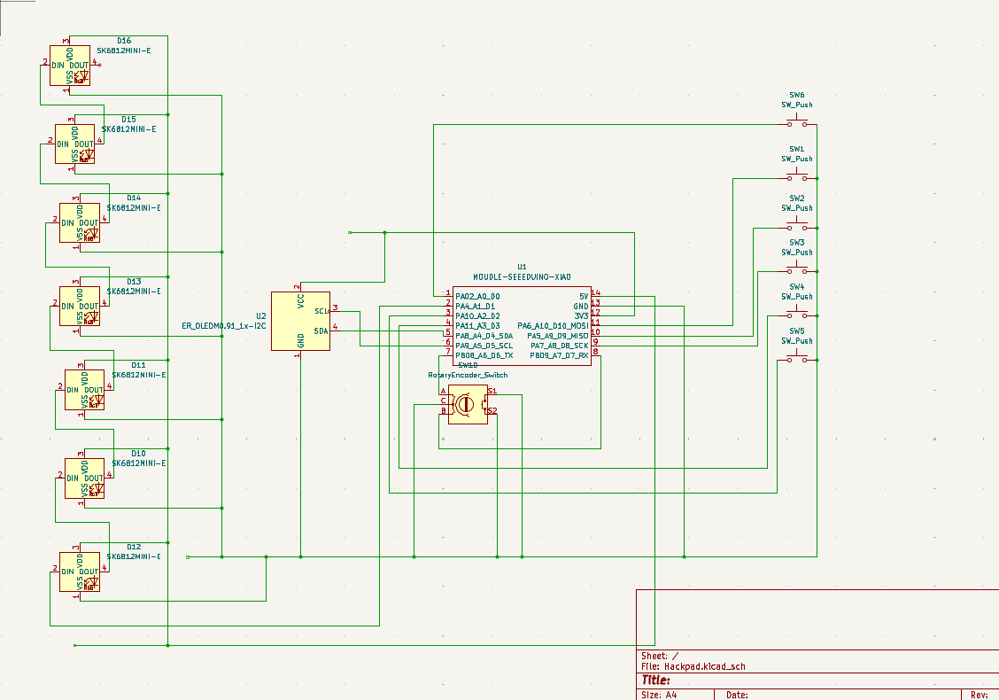
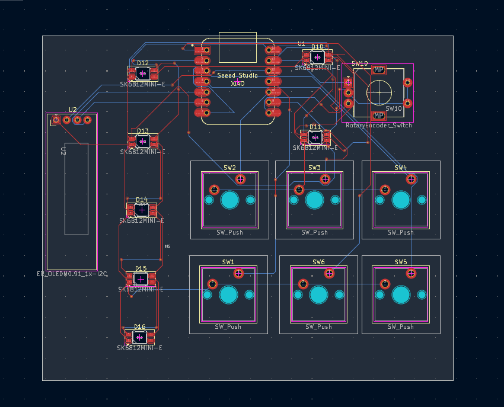

# Custom 6-Key Macropad with Rotary Encoder & OLED Display

A compact, DIY custom macropad built around the **Seeed Studio XIAO RP2040** microcontroller and running the open-source **KMK Firmware** (CircuitPython). This pad features 6 mechanical keyswitches, a 7-pixel chained NeoPixel RGB strip, a volume rotary encoder, and an SSD1306 128x64 OLED display running custom frame animations.

## 🚀 Features
* **Dynamic JSON Configuration:** Keybinds are completely modular and loaded on-the-fly from a local `commands.json` file without modifying the main firmware.
* **Volume Rotary Encoder:** Clockwise/counterclockwise scroll tracking mapped to system volume adjustments.
* **Custom OLED Animations:** Bypasses default KMK layer readouts to loop custom 1-bit `.pbm` flipbook animations.
* **RGB Breathing Effect:** Smooth breathing lighting profile across a 7-pixel NeoPixel LED chain.

---

## 🎨 Hardware Design, Schematics & Enclosure

### 📐 Schematic Diagrams
The circuit schematic handles direct GPIO switch tracking to keep the design highly responsive and simple, utilizing internal pull-up resistors on the RP2040.



### ⚡ Printed Circuit Board (PCB) Layout
The PCB routing is optimized for the tight form factor of the Seeed Studio XIAO footprint. Tracks are routed cleanly with thick power lines to safely drive the addressable NeoPixel rail.

| 2D PCB Layout Artwork | 3D Production Render |
| :---: | :---: |
|  |  |

### 📦 3D-Printed Case Enclosure
The enclosure features a low-profile, multi-part snap or screw assembly consisting of a top plate, a main housing chassis, and an integrated bezel to keep the SSD1306 display perfectly flush.


* **Layer Height:** 0.2mm
* **Infill:** 15% - 20% GYROID (for solid weight distribution)
* **Supports:** None required if oriented flat on the print bed.

---

## 📋 Bill of Materials (BOM)

To build this macropad, you will need the following electronic and structural components:

| Item | Qty | Component Description | Sourcing / Part Notes |
| :---: | :---: | :--- | :--- |
| 1 | 1 | **Seeed Studio XIAO RP2040** | Main Microcontroller Board |
| 2 | 1 | **0.96" SSD1306 OLED Display** | 128x64 Pixel Screen, I2C Interface |
| 3 | 1 | **EC11 Rotary Encoder** | 15mm or 20mm D-Shaft Encoder |
| 4 | 6 | **MX-Style Mechanical Switches** | Any linear, tactile, or clicky keyswitches |
| 5 | 6 | **MX-Compatible Keycaps** | Profile of your choice (e.g., Cherry, OEM, XDA) |
| 6 | 1 | **WS2812B NeoPixel LED Strip** | 7-Pixel count addressable LED chain |
| 7 | 1 | **Custom 3D-Printed Case Set** | Top plate and bottom housing frame |
| 8 | 4 | **M3 Screws / Rubber Feet** | Countersunk hardware for final assembly |

---

## 🛠️ Hardware Pinout Layout

The firmware maps directly to the following physical tracks on the Seeed Studio XIAO RP2040:

| Component | Pin / Track Assignment | Function |
| :--- | :--- | :--- |
| **SW1 (pos_1)** | `D9` | Mechanical Switch 1 |
| **SW2 (pos_2)** | `D8` | Mechanical Switch 2 |
| **SW3 (pos_3)** | `D3` | Mechanical Switch 3 |
| **SW4 (pos_4)** | `D10` | Mechanical Switch 4 |
| **SW5 (pos_5)** | `D0` | Mechanical Switch 5 |
| **SW6 (pos_6)** | `D2` | Mechanical Switch 6 |
| **NeoPixel Strip**| `D1` | 7-Pixel LED Data Line |
| **OLED SCL** | `D5` | I2C Clock Line |
| **OLED SDA** | `D4` | I2C Data Line |
| **Encoder Pad A**| `D6` | Quadrature Signal A |
| **Encoder Pad B**| `D7` | Quadrature Signal B |
| **Encoder Pad C**| `GND` | Common Ground Connection |

---

## 📂 File Structure Explained

Your `CIRCUITPY` drive root should look like this:

```text
├── kmk/                  # KMK Firmware Library Folder
├── boot.py               # Hardware/USB-level configuration script
├── main.py               # Main Python firmware script (The core brain)
├── commands.json         # Dynamic keymap configuration profile
└── animation.pbm         # 128x64 compiled monochrome flipbook image strip
